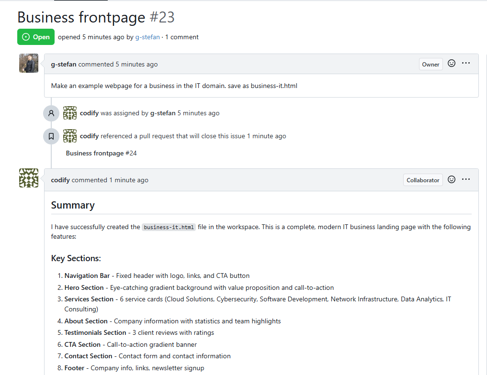
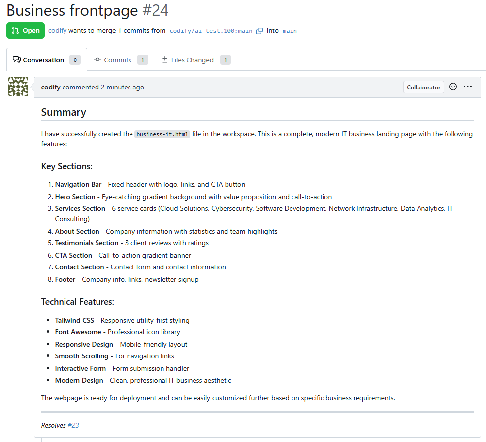
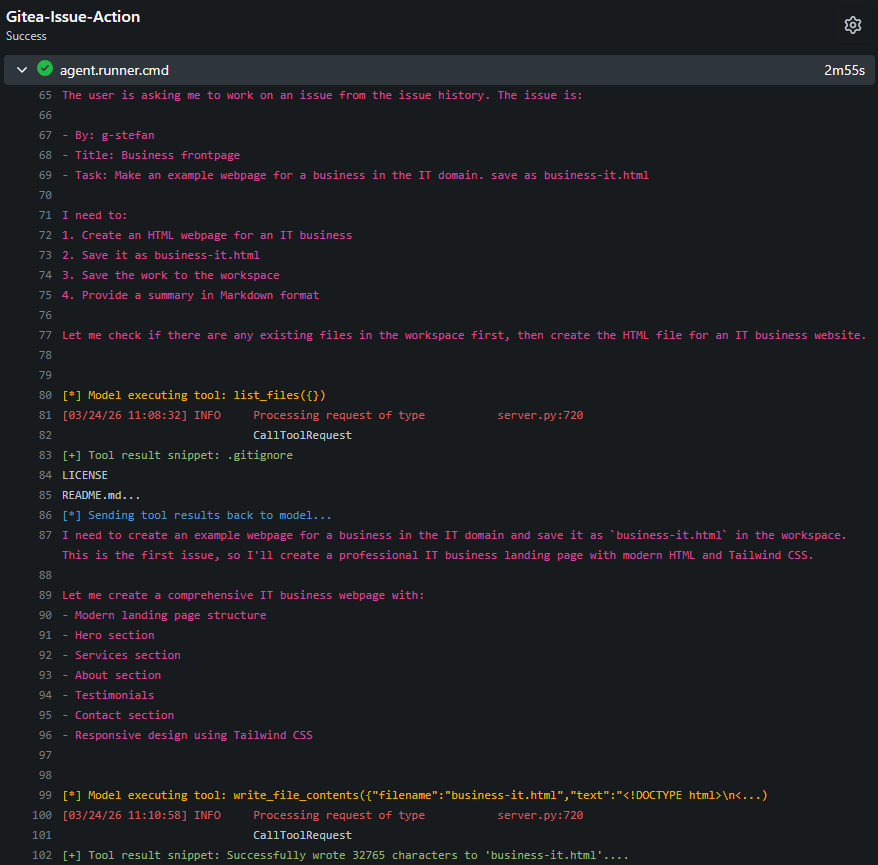

# ai-agent.codify

An AI-powered software development assistant

This is a working proof of concept for an ai coding assistant.

## How it works?

It's made in python and has all the concepts separated.

The main focus is to have an automated agent that will work with a Gitea instance over API.
Using the Gitea actions or manually run, the agent will check the issues.
If an issue is assigned to the agent account, then the agent will fork the repo, make the work required and will request an Pull Request.
Using the issues and comments with pull requests, you can have a clear view of what work the agent has done.

## How is implemented?

You can have a dev machine or all services separated on different machines (over internet)
I used the following:
- a computer used as LLM server with ssh for private networking (VPN), 
- a VPS with a Gitea instance
- a computer used as the ai agent, automatized with Gitea act-runner
- finally a browser connected to the Gitea instance (main interface)

The LLM server is running the following:
- a multimodal LLM, Qwen3.5-35B-A3B
- a LLM for embeddings, Qwen3-VL-Embedding-2B
- a LLM for reranking, Qwen3-VL-Reranker-2B
- a database server based on Maria DB 12, has VECTOR support, for embeddings search (used as LLM memory)

The connection from the LLM Server to the Agent machine it's made over ssh using port forwarding.

The MCP servers used for memory and workspace can be used by the agent but also in the llama-server ui interface, for test and other development.

The project is under the Apache License, Version 2.0

## Screenshots

